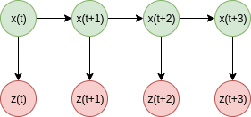

# Tracking

### Model for Tracking

#### State

State $$x(t)$$ is a vector of variable which denotes the system state at time $$t$$. For example state of system with a car on road along a axis can be defined by its position & velocity or by its position, velocity and acceleration.&#x20;

#### Observation

Many times, you does not have any information about the state of system but can only have some observation about it. Observation is generally denoted by $$y(t)$$or $$z(t)$$. Sometimes you can completely or partially observe the state of the system. For ex, in above example if can directly observe position & velocity then its fully observable and if you can observe either position or velocity then its partially observable. \
In case of object trackin, we consider object bouding boxes as its states $$x(t)$$and as we  can observe the image we call it the observation $$z(t)$$. But you will see that practically we consider x(t) as directly observable because we have using detectors we can directly get $$x(t)$$.

\
To understand this fully, we can draw parallel to control systems concept of state-space model:

$$
x(t+1) = Ax(x) + Bu(t) \\
y(t) = Cx(t) + Du(t)
$$

In this $$u(t)$$is the input to the system, which we can ignore in our computer tracking problem. So you can see that, our observation $$y(t)$$ directly depends upon the state $$x(t)$$.&#x20;

**Also, the above two equations are called transition model and observation model in our tracking literature.** As they denotes, how our model is gonna transition and what is the relation between bservation and state.&#x20;

### Tracking: Prediction and Filtering

### Kalman Filter

### Particle Filter

### From the course course on Computer Vision

* **Prediction:-** \
  ****
* **Correction :-**\
  ****
* **The Summary Video for 7B-L1 is very good for overall concept.**

**Kalman Filter:-**&#x20;

* **Linear Model:-**\
  **Linear Dynamics Model -** ****\
  **Linear measurement model -** 
* 
* **Tracking with Kalman Filter:-**\
  **** **** 
* **Extended Kalman Filter is used for NON-LINEAR Models.**&#x20;

**Particle Filter**

* **Watch this for basic idea :-** [**https://youtu.be/aUkBa1zMKv4**](https://youtu.be/aUkBa1zMKv4) ****&#x20;
* **Note that they assume that MAP OF ENVIRONMENT IS KNOWN.**
* 
* **Bayes Filter :-**\
  **** **** ****\
  **Here P(z|x) is probability that if given particle at x then what is probability of measurement z at there.**\
  ****
* ****\
  ********\
  ********\
  ********\
  ****
* **7C - L2 - Very good for understanding robot motion using particle filters.**
* **9th video 7C-L3 particle filter for practical consideration is important.**
