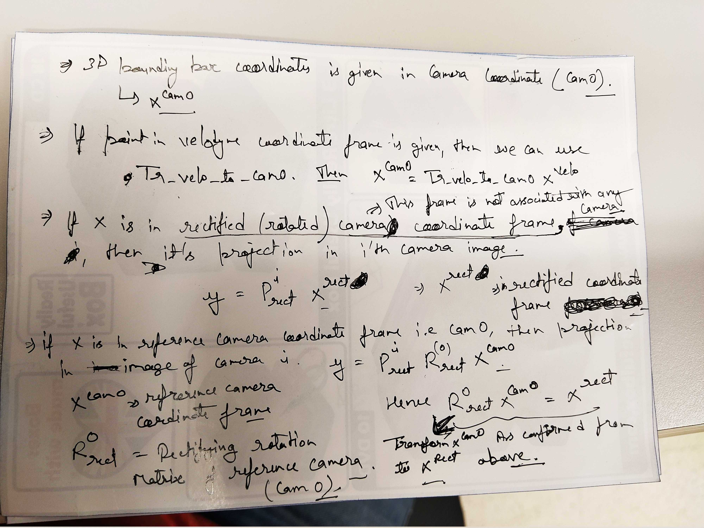

# Kitti

### Understanding the Calibration file

This file basically contains all the transform between between different frames of camera such as velodyne, camera, etc. 

Use following links to understand it:





#### Main equation for transformation 

$$
y = P_{rect}^i x^{rect}
$$

In the `calib.txt` file, the $$P_0, P_1, P_2, P_3$$matrices are the projection matrix which project the 3D point $$x_{rect}$$in rectified camera coordinate frame to image coordinates of camera $$i$$. Please note that rectified camera coordinate frame is not related to any camera $$i$$. So basically these $$P_i$$given in calib.txt are actually$$P_{rect}^i$$ and takes points in rectifies camera coordinate and not points in $$i^{th}$$camera coordinate frames. 

$$
y = P_{rect}^i R_{rect}^0 Tr^{velo-to-cam0} x^{velo}
$$

This is one of the main equation given in the readme.md file for transformations of points. Here $$x^{velo}$$is 3D point in velodyne coordinate frame. $$Tr^{velo-to-cam0}$$ transform an point from velodyne to reference camera \(cam0\) coordinate frame. ie. $$x^{cam0} = Tr^{velo-to-cam0}x^{velo}$$. $$x^{cam0}$$is in cam0 coordinate frame, cam0 is reference camera in kitti. 

$$
x^{rect}= R_{rect}^0x^{cam0}
$$

We need $$x$$in rectified frame to be worked with $$P_{rect}^i$$. Hence we use $$R_{rect}^0$$which transform point from cam0 coordinate frame to rectified coordinate frame. 

###  Different Packages for using Kitti Dataset

Python Package to read Kitti data. 



Covert Kitti dataset to ROS Bag or Publish as ROS topics. 



