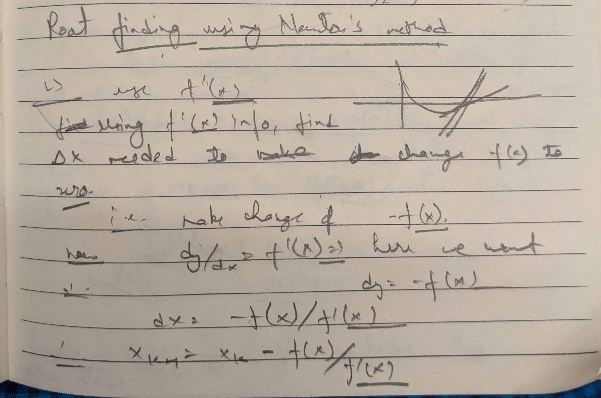
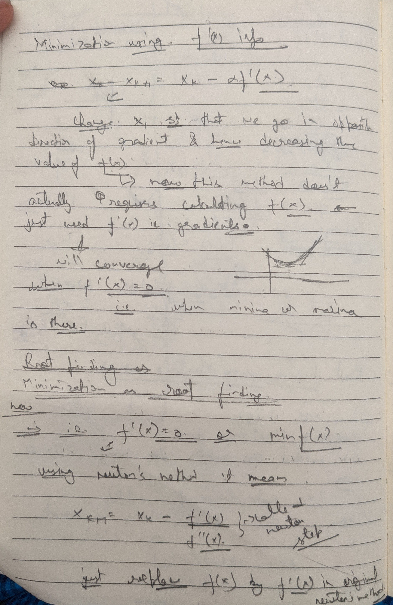
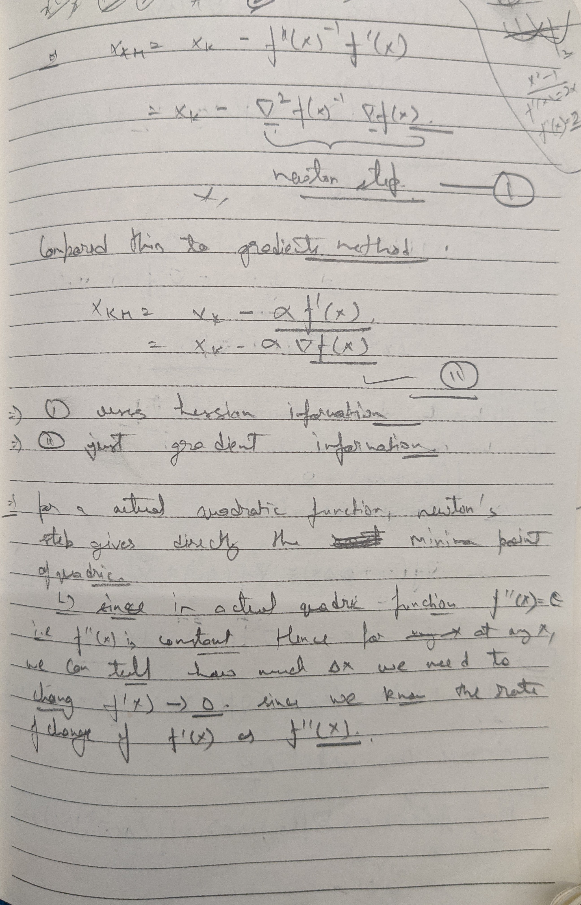

# Newton's Method

### Find Root of non-linear function

Used to find the roots of an function $$f(x)=0$$. It uses taylor series expansion for that. It's an iterative process. Let $$x_0$$be initial starting point. Let's say next point is $$x_1 = x_0 + \Delta x$$, which is the root of the $$f(x)=0$$. Then $$0 = f(x+\Delta x) = f(x) + \Delta x f'(x)$$. Which means $$\Delta x = -\frac{f(x)}{f'(x)}$$.

### Finding minimum of a function

Let's say you have a function $$f(x)$$whose minimum you want to find, this means $$f'(x)=0$$. Hence you can just use newton's method to find root of $$f'(x)=0$$. This will find the minimum of $$f(x)$$if $$f''(x)>0$$.&#x20;

So

$$
f(x+t) = f(x)+t f'(x) + \frac{1}{2}t^2f''(x)
$$

​Now we want&#x20;

$$
\frac{df(x+t)}{dt} = 0 \\
f'(x) + t f''(x) = 0 \\ 
t = \frac{-f'(x)}{f''(x)}
$$

Therefor $$x' = x+t = x ​- \frac{f'(x)}{f''(x)}$$.&#x20;

* If the function $$f$$is actually quadratic then the above method will give you the minimum in exactly in one iteration.&#x20;
* It has quadratic convergence.&#x20;
* Calculating the inverse of hessian is a very computationally expensive operation, which causes newton's method to be slow.&#x20;
* It can be very sensitive to the initialization of the algorithm.&#x20;

### Connection with Gradient Descent

So how gradient descent works, is by replacing a function at a point by it's linear approximation at that point using the gradient of the function and then moving along the negative gradient of the line. But it only gradient only gives the direction to move and not the magnitude of movement, for which we use step size which determines how much to move. Now, if step size is too big then we might be oscillating as we might overshoot the actual minimum, if step size is too small then it might take too many iterations to reach the minimum.&#x20;

**So now, we can see** $$\frac{1}{f''(x)}$$​(**inverse hessian, or inverse of curvature) as the step size. Because if the curvature is high, it means the gradient is changing quickly so we need to take small step sizes and conversely if the curvature is low it means we can take big step sizes.  Hence,** $$\frac{1}{f''(x)}$$**is basically a smart/adaptive step size based on the curvature of the function.**&#x20;

### ​Resources



### Thoughts

<figure><figcaption></figcaption></figure>

<figure><figcaption></figcaption></figure>

<figure><figcaption></figcaption></figure>

