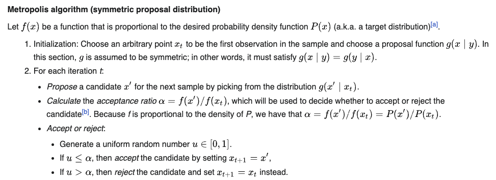

# MCMC - Monte Carlo Markov Chain

## Intro



This video gives good description of how does **MCMC sampling** works. What's described in this video is Metropolis–Hastings algorithm - which is a type of MCMC sampling method.&#x20;

#### Metropolis–Hastings algorithm

<figure><figcaption></figcaption></figure>

This algorithm converge to the pdf in the limit of infinite samples.&#x20;

### What does MCMC do?&#x20;

Let's say you have a pdf. Actually let's loosen the assumption, **let's say you a function that's proportional to pdf**, which is basically called unnormalised pdf. Then how can you draw samples from it?&#x20;

**MCMC is sampling method**. In MCMC, you sample sequence of points (hence a markov chain), where sample at each step is depend on the previous sample. Then when you plot all the samples in the chain, you will get a histogram that looks like the pdf. &#x20;


**MCMC** particularly shines in higher dimensions, where analytical methods doesn't work. Why?

Answer: Because generally to sample from probability density functions, you need have them. But in high dimensions, it becomes hard to find normalized pdfs, as finding the integral that normalize pdf becomes intractable in high dimensions. Hence we don't have exact pdf. \
Since MCMC works with unnormalized pdf, hence avoiding calculating the intractable integrals, it shins when sampling in high dimension.&#x20;


### Deriving MCMC

Let's say we will have a chain, $$x_1 \rightarrow x_2 \rightarrow x_3 \rightarrow .......  \rightarrow x_n$$. Now what we want is that these samples will induce stationary distribution, ie at $$n \rightarrow \inf$$, the distribution will stop chaning.&#x20;

At that instance we can use, fixed points theorem. It at equillibrium, we will have following equations hold true. Consider two states, $$x$$ and $$y$$. So now let's say we have stationary distribution $$\pi$$ , ie we will have two probabilities $$\pi(x)$$ and $$\pi(y)$$. &#x20;

Now what we are interested is finding the transition probabilities, that's what defines the Markov Chain, so probabilities $$P(Y|X)$$ and $$P(X|Y)$$. Note that since we are only considering two states $$P(X|X) = 1- P(Y|X)$$ and similarly for $$P(Y|Y)$$.

So now at equillibrium, we can write following for the stationary distribution.&#x20;

$$
\pi(y) = P(y|x)\pi(x) + P(y|y)\pi(y) \\
 = P(y|x)\pi(x) + (1-p(x|y))\pi(y)
$$

Basically, in the above eqn, we write that probability of being in state $$y$$ is equal to: probability in being state x and then transition from x to y, or being already in state y and transition from y to y.&#x20;

On reducing the above eqn, we will get

$$
\pi(y)P(x|y) = \pi(x)P(y|x)
$$

The two quanties on LHS and RHS are net probaility of  \[being in y and going to x from y] and \[being in x and going to y from x] respectively.&#x20;

**Can we seen as : In equilibrium, the "flow" from state x to state y should equal the flow from y to x.**

\
