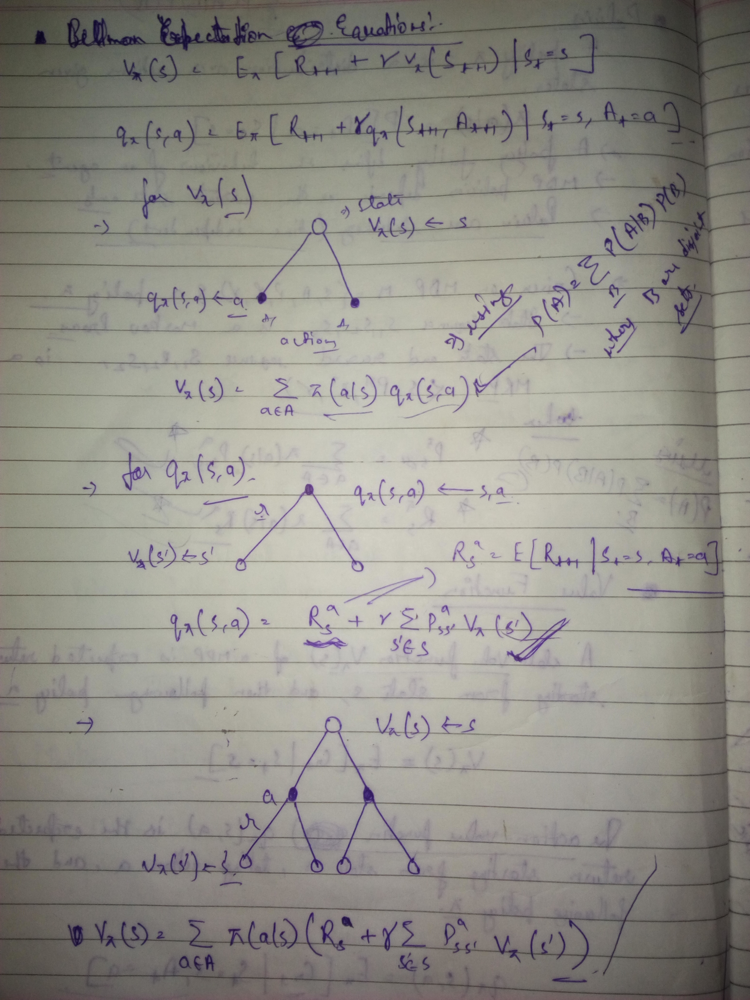

# MDP Equations

Episode: **\(s,a,s\`,r\)**  
Let’s say when we are in state s, we decide to take action a to arrive in the next state s’ and obtain reward r.

### Model: Transition and Reward

$$
P(s^`, r\;|\;s,a) = P[S_{t+1}=s^`, R_{t+1}=r\;|\;S_t = s, A_t=a]\\
P_{ss^`}^a = P[S_{t+1}=s^`\;|\; S_t=s, A_t=a] = \sum_{r \in R}P(s^`, r\;|\;s,a)\\
R(s,a) = E[R_{t+1}|S_t=s, A_t=a] = \sum_{r \in R}\sum_{s^` \in S}P(s^`, r\;|\;s,a)\times r\\
= \sum_{s^` \in S}P(s^`, r\;|\;s,a)\times R(s,a,s`)
$$

In this, the first equation represents the model, which is the joint probability distribution of reward and future state given current state and action taken. The reward given state and action taken can be calculated using summation over all possible values of r and weighing according to probability of occurring. **Note: We can remove the double summation in calculating R\(s,a\) as R: SxAxS -&gt; R i.e. it is completely determined by s,a,s'. Hence, we can remove the summation over r as once s,a,s' are fixed, we will have only one value of r to sum over.** 

$$
\pi(a|s) = P[A_t = a| S_t=s]\\
R_\pi (s) = \sum_{a\in A}\pi (a|s)R(s,a)\\
P_{ss^`}^\pi = \sum_{a\in A}P_{s\acute{s}}^a\pi(a|s)
$$

The above equation is proved using **law of total probability.**

### Lets start with value and action-value function for RL

$$
G_t = R_{t+1} + \gamma R_{t+2} + ...\;\;\;\;1\\
V_\pi (s)= E[G_t | S_t = s] \;\;\;\;\;\;\;\;\;\;\;\; 2\\
Q_\pi (s,a)= E[G_t|S_t =s, A_t=a] \;\;3
$$

**In this, first ask why the Expectation is needed for fixed policy?  
Ans:** Even if the policy is fixed, it determines the probability of transition between states given current state and action taken. Now, if we want to **calculate the return** $$G_t$$ **we have to weight the reward from each state according to the the probability of transition and probability of each action that can be taken which is determined by policy**. Hence, in order to weight the reward according to transition probability and policy, we have to take the **expectation**. 

### Bellman Equation

$$
V_\pi = \sum_{a\in A}\pi(a|s)Q_\pi (s,a)\\
Q_\pi (s,a) = R_s^a + \gamma \sum_{s^`\in S}P_{ss^`}^aV_\pi(s^`)\\
$$

These equation are derived using **law of total expectation or law of iterative expectation.** Click here to see the derivation.  

On solving

$$
V_\pi(s) = \sum_{a\in A}\pi(a|s)Q_\pi (s,a)\\
=  \sum_{a\in A}\pi(a|s)(R_s^a + \gamma \sum_{s^`\in S}P_{ss^`}^aV_\pi(s^`))\\
= \sum_{a\in A}\pi(a|s)R_s^a \;+ \gamma\sum_{s^`\in S}\sum_{a\in A}\pi(a|s) P_{ss^`}^aV_\pi(s^`))\\
= R_s^\pi + \gamma\sum_{s^`\in S}P_{ss^`}^\pi V_\pi(s^`)\\
= R_s^\pi + \gamma E[V_\pi(s^`)]\\
$$

**Note:** $$E[V_\pi(s^`)] = \sum_{s'\in S}P_{ss'}^\pi V_\pi(s')$$, when using this equation we consider $$s'$$ is the random variable. But when $$E[V_\pi(s^`)] = \sum_{a \in A}\sum_{s'\in S}\pi(a|s) P_{ss'}^a V_\pi(s')$$ is used, then, $$a\text{ and } s'$$ are random variables and summation is done relative to both. 

$$
Q_\pi(s,a) = R_s^a + \gamma\sum_{s' \in S}P_{ss'}^aV_\pi(s')\\
= R_s^a + \gamma\sum_{s' \in S}P_{ss'}^a\sum_{a' \in A}\pi(a'|s')Q_\pi(s', a')\\
= R_s^a + \gamma\sum_{s' \in S}\sum_{a' \in A}P_{ss'}^a\times\pi(a'|s')\times Q_\pi(s', a')\\
= R_s^a + \gamma E[Q_\pi(s',a')]
$$

### Optimality

$$
\pi^* = \text{arg}\max_\pi\;V_\pi(s) = \text{arg}\max_\pi \;Q_\pi(s,a) \;\;\forall s,a\\
V_{\pi^*} = \max_\pi V_\pi(s)\;\;\; \forall s\\
Q_{\pi^*} = \max_\pi Q_\pi(s,a)\;\; \forall s
$$

$$\pi^* $$ is the optimal policy. This policy have the maximum value function for all states. Now there will always be a deterministic optimal policy for a MDP, which we can find out using the action-value function. The action for a state which provide the maximum value gets the probability **1** and other actions get probability **0**.

#### Bellman Optimality equations

$$
V_*(s) = \max_a Q_*(s,a)\\
Q_*(s,a) = R_s^a + \gamma \sum_{s^`\in S}P_{ss_`}^a V_*(s^`)
$$

The Bellman optimality equations are non-linear and no closed form solution exist like in the case of bellman expectation equations. Hence, it is difficult to solve for optimality exactly, hence we take use of other methods to find optimal state-value and action-value function.

### Law of Iterative Expectation

$$
E_Y[E[X|Y]] = \sum_{y\in Y}E[X|Y=y]P_Y(y) = \sum_{y\in Y}\left(\sum_{x\in X}xP_X(x|Y=y)\right)P_Y(y)\\ = \sum_{x\in X}x\left(\sum_{y\in Y}P_X(x|Y=y)P_Y(y)\right) =\sum_{x\in X}xP_X(x)\\ = E[X]
$$

Now see, how this is used to establish the relationship between state value and action value function. 

$$
V(s) = E[G_t|S_t=s]\\
Q(s,a) = E[G_t|S_t=s, A_t=a]\\
$$

$$
V(s) = \sum_{a \in A}\pi(a|s)Q_\pi(s,a)\\
E[G_t|S_t=s] = \sum_{a\in A}P(a|S_t=s)E[G_t|S_t=s, A_t=a]\\
E[X] = \sum_{y \in Y}P_Y(y)E[X|Y]\\
E[X] = E_Y[E[X|Y]]
$$

**So, replacing** $$X   $$ **by** $$G_t|S_t$$ **and** $$Y$$ **by** $$A_t$$ **gives the same equation as that of Law of total expectation.** 

Make sure that you under the equation the **V and Q** equation without the law, it is just common sense same as used in law of total probability. It is just that you divide an event into independent conditioned events and weight those according to their probability of occurring.  

### Policy

**Stationary:** These policy depends only upon current state and doesn't change with time.   
**Non-Stationary:** In these, policy may change with time, hence different action may be choosen at different time given the same current state. 

