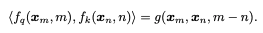

# Masked Autoencoders

<figure><figcaption>
During pre-training, a large random subset of image patches (e.g., 75%) is masked out. The encoder is applied to the small subset of visible patches. Mask tokens are introduced after the encoder, and the full set of encoded patches and mask tokens is processed by a small decoder that reconstructs the original image in pixels. After pre-training, the decoder is discarded and the encoder is applied to uncorrupted images (full sets of patches) for recognition tasks.
</figcaption></figure>

### Key Points

* Self-supervised learning
  * But not contrastive learning, there are no negative pairs.&#x20;
  * The masked patch prediction learns some representation
* Masked Patch Prediction
* In ViT, the encoder was trained for class prediction. Whereas in MAE, the encoder/decoder are trained for masked patch prediction sort of image reconstruction.&#x20;
* **More sample efficient training compared to ViT training, as we are using self-supervision.**&#x20;
* Can be considered as a framework to train ViT-like transformers
* Masked Autoencoder can be considered like BERT but for images, where the masked tokens are predicted by neighbouring tokens.&#x20;
* **Note that the model is not good enough to generate the same quality images, ie not great reconstruction quality.  But the point is that the representation learned by the model is good enough, which can be used by downstream tasks.**&#x20;
* This is pre-training to learn representation followed by task-specific paradigm.&#x20;

### Approach

* Mask random patches in the image (about 75%), then reconstruct the missing patches/pixels with input as remaining patches/pixels.&#x20;
* The encoder is given a visible subset of patches (not masked patches) as input. Then there is a decoder that predicts the complete image (visible and masked patches) using latent representation (output of the encoder) and mask tokens (just placeholder tokens). &#x20;
* This approach allows for more sample-efficient training.&#x20;

### Questions

* Why can't patches in ViT or MAE be overlapping?&#x20;
  * The patches can be overlapping, but that comes at the cost of additional computation. And probably with a minor improvement in the performance. Though there will be more continuity in the token embeddings.&#x20;
* Why does a higher masking ratio seem to give better performance?&#x20;

<figure><figcaption>
Not great reconstruction quality for images
</figcaption></figure>
